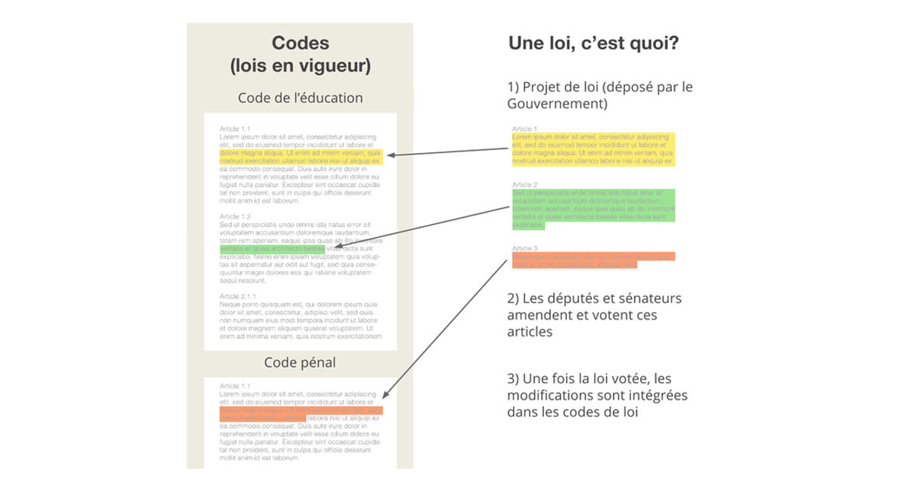
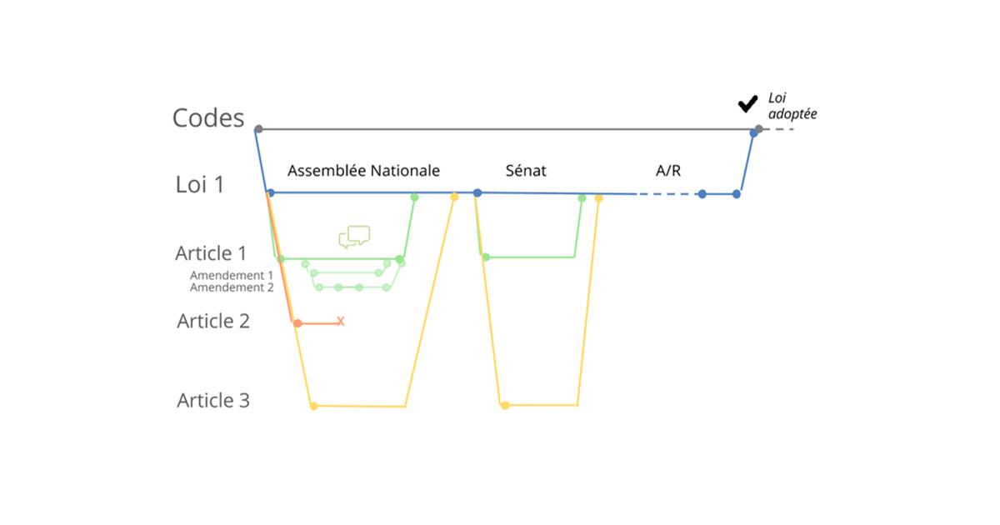

# Formation github

## GIT ??

## Repository Hosting Service

* Github: 9 millions d'utilisateurs (2015) (1,4M en 2012), 21,1 millions de projets (2015) (2,4M en 2012). --> grand public
* BitBucket: 2,5M users --> more corporate (2014)
* GitLab: +100k users  --> more "geek"

## Coucou tout le monde

Liens intéressant:

* [free-book programing](https://github.com/vhf/free-programming-books)
* [gitcheat](https://github.com/tiimgreen/github-cheat-sheet)
* [DemocracyOS](http://democracyos.org/), [DemoOSFr](http://democracyos.eu/)
* [Parol](http://parol-production.herokuapp.com/)
* [OpenGov](http://opengovfoundation.org/)
* [OpenGouvernment](http://opengovernment.org/)
* [DémocracieOuverte](http://democratieouverte.org/)

Exemple de repot:

[lewagon](https://github.com/lewagon/www/network)

##MarkDown
